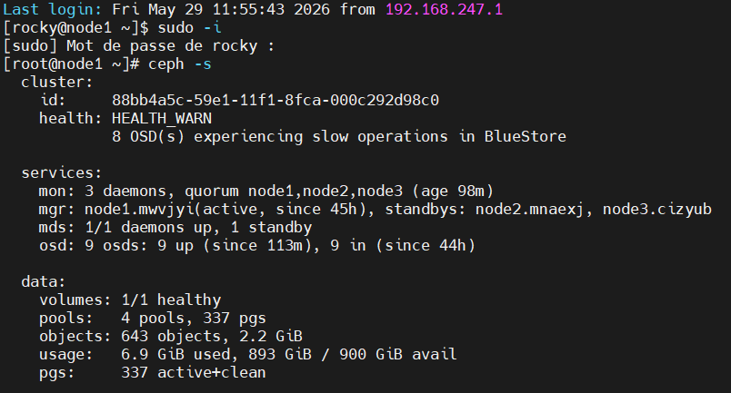
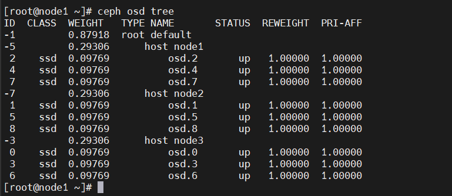
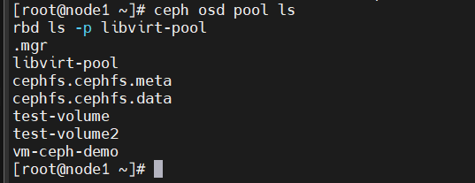
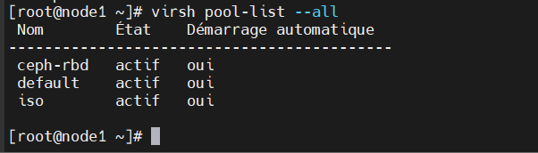
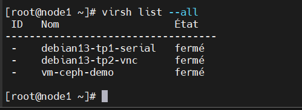
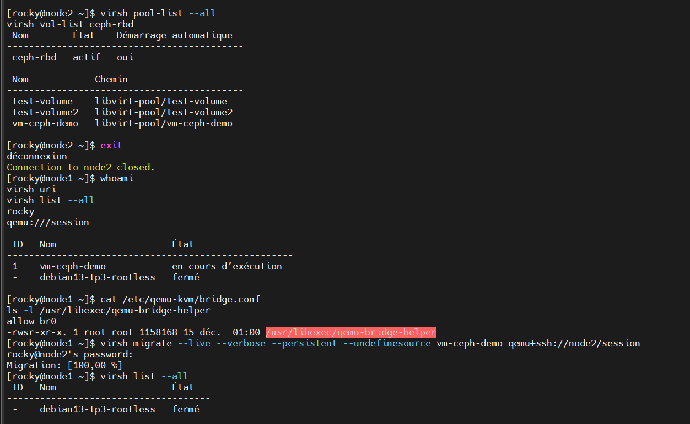
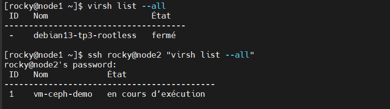
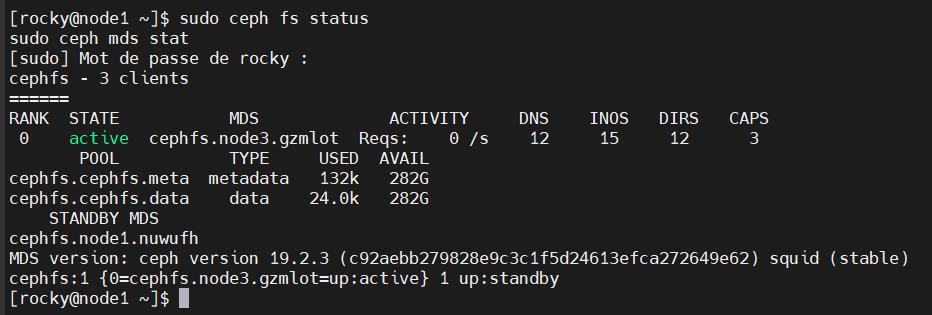
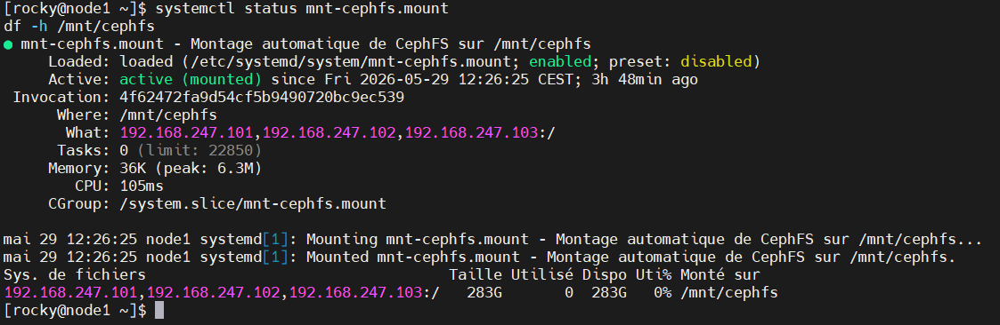

# 🔷 Ceph Libvirt HA Lab

> **Infrastructure hyperconvergée** — Cluster Ceph 3 nœuds avec stockage distribué RBD, CephFS et intégration Libvirt/KVM en environnement VMware Workstation. Live migration de VMs validée entre nœuds KVM.


---

## 📐 Architecture globale

```
┌─────────────────────────────────────────────────────────────────────────────┐
│                        VMware Workstation (Hôte physique)                   │
│                         Réseau : 192.168.247.0/24                           │
│                                                                             │
│  ┌──────────────────┐  ┌──────────────────┐  ┌──────────────────┐          │
│  │     node1        │  │     node2        │  │     node3        │          │
│  │ 192.168.247.101  │  │ 192.168.247.102  │  │ 192.168.247.103  │          │
│  │  Rocky Linux 10  │  │  Rocky Linux 10  │  │  Rocky Linux 10  │          │
│  │                  │  │                  │  │                  │          │
│  │  ● MON  (lead)   │  │  ● MON           │  │  ● MON           │          │
│  │  ● MGR  (lead)   │  │  ● MGR (standby) │  │  ● MDS           │          │
│  │  ● OSD.0         │  │  ● OSD.3         │  │  ● OSD.6         │          │
│  │  ● OSD.1         │  │  ● OSD.4         │  │  ● OSD.7         │          │
│  │  ● OSD.2         │  │  ● OSD.5         │  │  ● OSD.8         │          │
│  │  ● Libvirt/KVM   │  │  ● Libvirt/KVM   │  │  ● Libvirt/KVM   │          │
│  │  /dev/sdb/c/d    │  │  /dev/sdb/c/d    │  │  /dev/sdb/c/d    │          │
│  │  (3 × 100 Go)    │  │  (3 × 100 Go)    │  │  (3 × 100 Go)    │          │
│  └────────┬─────────┘  └────────┬─────────┘  └────────┬─────────┘          │
│           └─────────────────────┼─────────────────────┘                    │
│                    ┌────────────▼────────────┐                              │
│                    │   CEPH 19.2.3 Squid      │                              │
│                    │  ┌────────────────────┐  │                              │
│                    │  │ Pool RBD           │  │                              │
│                    │  │ libvirt-pool       │  │                              │
│                    │  │ → VMs + migration  │  │                              │
│                    │  └────────────────────┘  │                              │
│                    │  ┌────────────────────┐  │                              │
│                    │  │ CephFS             │  │                              │
│                    │  │ /mnt/cephfs        │  │                              │
│                    │  └────────────────────┘  │                              │
│                    └──────────────────────────┘                              │
└─────────────────────────────────────────────────────────────────────────────┘
```

---

## 🗂 Table des matières

1. [Environnement technique](#-environnement-technique)
2. [Plan d'adressage](#-plan-dadressage)
3. [Préparation des nœuds](#1-préparation-des-nœuds)
4. [Déploiement du cluster Ceph](#3-déploiement-du-cluster-ceph)
5. [Déploiement des MON et MGR](#4-déploiement-des-mon-et-mgr)
6. [Déploiement des OSD](#5-déploiement-des-osd)
7. [Création du pool RBD](#6-création-du-pool-rbd-pour-libvirt)
8. [Intégration Ceph RBD + Libvirt](#7-intégration-ceph-rbd-avec-libvirt)
9. [Création d'une VM sur RBD](#8-création-dune-vm-sur-ceph-rbd)
10. [Live Migration KVM](#9-migration-de-vm-entre-deux-nœuds)
11. [CephFS](#10-création-et-test-de-cephfs)
12. [Montage automatique systemd](#️-montage-automatique-via-systemd)
13. [État final & validation](#-état-final-du-cluster)
14. [Commandes utiles](#-commandes-de-diagnostic)

---

## 🖥 Environnement technique

| Élément | Configuration |
|---|---|
| Hyperviseur hôte | VMware Workstation |
| OS des nœuds | Rocky Linux 10.1 |
| Nombre de nœuds | 3 |
| Réseau | 192.168.247.0/24 |
| Stockage OS | 50 Go par VM |
| Stockage Ceph | 3 × 100 Go par nœud (9 OSD au total) |
| Version Ceph | **Ceph 19.2.3 Squid** |
| Virtualisation | Libvirt / KVM / QEMU |
| Stockage VM | Ceph RBD |
| Système de fichiers distribué | CephFS |

---

## 🗺 Plan d'adressage

| Nœud | Adresse IP | Rôle |
|---|---|---|
| node1 | 192.168.247.101 | MON, MGR (lead), OSD, Libvirt/KVM |
| node2 | 192.168.247.102 | MON, MGR (standby), OSD, Libvirt/KVM |
| node3 | 192.168.247.103 | MON, MDS, OSD, Libvirt/KVM |

---

## 1. Préparation des nœuds

```bash
dnf install -y cephadm ceph libvirt qemu-kvm virt-install chrony
systemctl enable --now chronyd
systemctl enable --now libvirtd
```

---

## 2. Vérification réseau et stockage

```bash
ping -c 2 node2 && ping -c 2 node3
lsblk
```

---

## 3. Déploiement du cluster Ceph

```bash
cephadm bootstrap --mon-ip 192.168.247.101
ssh-copy-id -f -i /etc/ceph/ceph.pub root@node2
ssh-copy-id -f -i /etc/ceph/ceph.pub root@node3
ceph orch host add node2 192.168.247.102
ceph orch host add node3 192.168.247.103
```

---

## 4. Déploiement des MON et MGR

```bash
ceph orch apply mon --placement="3 node1 node2 node3"
ceph orch apply mgr --placement="2 node1 node2"
```

---

## 5. Déploiement des OSD

```bash
ceph orch apply osd --all-available-devices
```

### ✅ Résultat — Santé du cluster



### ✅ Résultat — Arborescence OSD



---

## 6. Création du pool RBD pour Libvirt

```bash
ceph osd pool create libvirt-pool 64 64
ceph osd pool application enable libvirt-pool rbd
rbd pool init libvirt-pool
```

### ✅ Résultat — Pools et volumes RBD



---

## 7. Intégration Ceph RBD avec Libvirt

```bash
ceph auth get-or-create client.libvirt \
  mon 'profile rbd' \
  osd 'profile rbd pool=libvirt-pool' \
  mgr 'profile rbd pool=libvirt-pool' \
  -o /etc/ceph/ceph.client.libvirt.keyring
```

### ✅ Résultat — Pool Libvirt actif



---

## 8. Création d'une VM sur Ceph RBD

```bash
virt-install \
  --name vm-ceph-demo \
  --memory 1024 \
  --vcpus 1 \
  --import \
  --disk vol=ceph-rbd/vm-ceph-demo,bus=virtio,format=raw \
  --network bridge=br0 \
  --graphics vnc,listen=0.0.0.0 \
  --os-variant debian12 \
  --noautoconsole
```

### ✅ Résultat — VM en cours d'exécution



---

## 9. Migration de VM entre deux nœuds

```bash
virsh migrate --live --verbose --persistent --undefinesource \
  vm-ceph-demo qemu+ssh://node2/session
```

### ✅ Résultat — Live Migration à 100% ⭐



---

## 10. Création et test de CephFS

```bash
ceph fs volume create cephfs
mkdir -p /mnt/cephfs
mount -t ceph node1,node2,node3:/ /mnt/cephfs -o name=admin,secret=<SECRET>
echo "CephFS OK depuis node1" > /mnt/cephfs/test-cephfs.txt
```

### ✅ Résultat — CephFS actif





---

## ⚙️ Montage automatique via systemd

```bash
tee /etc/systemd/system/mnt-cephfs.mount << 'EOF'
[Unit]
Description=Mount CephFS on /mnt/cephfs
After=network-online.target ceph.target
Wants=network-online.target

[Mount]
What=node1,node2,node3:/
Where=/mnt/cephfs
Type=ceph
Options=name=admin,secretfile=/etc/ceph/cephfs.secret,_netdev,noatime

[Install]
WantedBy=multi-user.target
EOF

systemctl daemon-reload
systemctl enable mnt-cephfs.mount
systemctl start mnt-cephfs.mount
```

### ✅ Résultat — Montage systemd actif



---

## ✅ État final du cluster

| Point de validation | Statut |
|---|---|
| 3 nœuds dans le cluster | ✅ |
| 3 moniteurs en quorum | ✅ |
| 9 OSD actifs (9 up, 9 in) | ✅ |
| Pool RBD libvirt-pool opérationnel | ✅ |
| VM vm-ceph-demo stockée dans Ceph RBD | ✅ |
| Live migration validée (node1 → node2) | ✅ |
| CephFS monté sur /mnt/cephfs | ✅ |
| Montage automatique via systemd | ✅ |

---

## 🔍 Commandes de diagnostic

```bash
ceph -s                            # Statut global
ceph health detail                 # Détail des alertes
ceph osd tree                      # Arborescence CRUSH
ceph df                            # Utilisation stockage
ceph fs status cephfs              # Santé CephFS
rbd ls libvirt-pool                # Images RBD
virsh pool-list --all              # Pools Libvirt
systemctl status mnt-cephfs.mount  # Montage CephFS
```

---

## ⚠️ Limites du lab

Ce projet a été réalisé dans un environnement de laboratoire virtualisé. Les performances observées ne représentent pas celles d'un cluster Ceph de production.

Certaines alertes Ceph liées à BlueStore peuvent apparaître dans VMware Workstation en raison de la couche de virtualisation des disques.

---

## 📚 Références

- [Documentation officielle Ceph](https://docs.ceph.com)
- [cephadm — Orchestrateur officiel](https://docs.ceph.com/en/latest/cephadm/)
- [Ceph RBD + libvirt](https://docs.ceph.com/en/latest/rbd/libvirt/)
- [CephFS — Ceph Filesystem](https://docs.ceph.com/en/latest/cephfs/)
- [virsh migrate — KVM Live Migration](https://libvirt.org/manpages/virsh.html#migrate)
- [Systemd mount units](https://www.freedesktop.org/software/systemd/man/systemd.mount.html)

---

## 👤 Auteur

Projet réalisé par **Fréderic Junior EPESSE PRISO** dans le cadre du cursus **M2 — Virtualisation et clustering d'infrastructure** (2025-2026).
Encadrant : Kevin Chevreuil

---

*Lab reproductible sur VMware Workstation avec 3 VMs Rocky Linux 10.1 — Ceph 19.2.3 Squid.*
